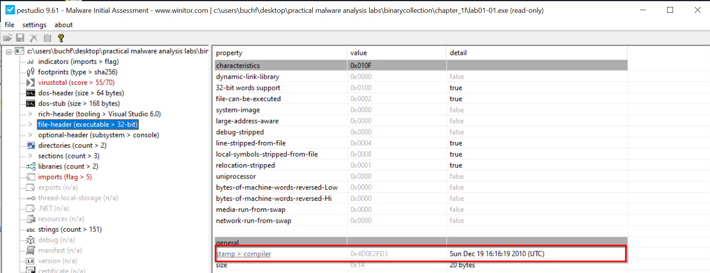
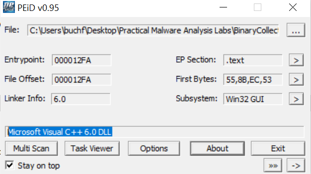
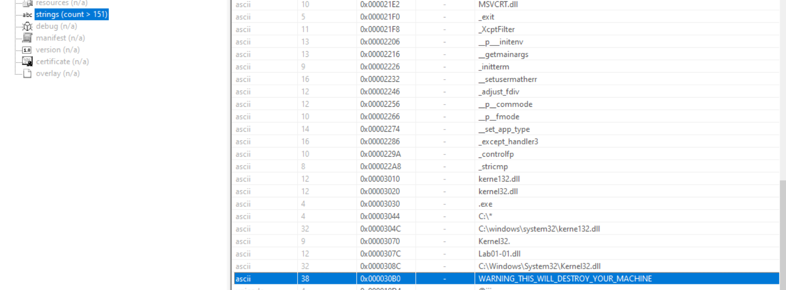
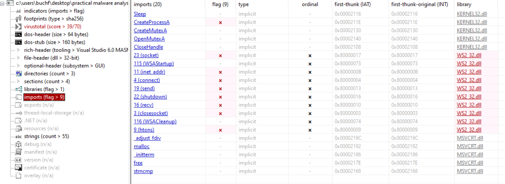

+++
title = "Basic Static Analsysis - Lab 1"

+++

## 1. VirusTotal Reports

- 55/70 vendors flag lab01-01.exe as malicious
- 39/70 vendors flag lab01-01.dll as malicious

**A: Yes, the files match existing antivirus signatures**

## 2. Compile Time

We inspect the file headers of the executable and DLL with *pestudio*. They were compiled at ``Sun Dec 19 16:16:19 2010 (UTC)`` and ``Sun Dec 19 16:16:38 2010 (UTC)``, respectively.

## 3. Indicators of Packing or Obfuscation

In the first chapter we have learned three basic techniques to detect whether a file is packed:

1. **PEiD** attempts to identify the packer used. For both Lab01-01.exe and Lab01-01.dll, it identifies the compiler **Microsoft Visual C++ 6.0**. This does not indicate any packing or obfuscation.

2. We can list the **imported functions** and **readable strings**. If the amount of either is suspiciously small, it could indicate obfuscation being used. We can use **pestudio** again to view either information.

We will further inspect the imports in the fourth section. Going by the strings in lab01-01.exe, the plainly readable ``WARNING_THIS_WILL_DESTROY_YOUR_MACHINE`` clearly speaks against any obfuscation in place. In lab01-01.dll, we find a plain-text IP address ``127.26.152.13`` and imports that hint at network connections being made.

3. We can compare the size of **raw data** (space on disk) against the **virtual size** (allocated during loading) of the sections in a file. If the raw data is much smaller than the allocated size, then a packer is likely being used to extract the data for the respective sections during execution.

Again, we can investigate the sections with **pestudio**. First of all, there are no identifier-renamed section headers. Only ``.text``, ``.rdata``, ``.data``, and ``.reloc``. Further, the raw size is in all sections larger than the virtual size being allocated.

**A: Using basic static analysis, there are no obvious indicators of obfuscation in either file**

## 4. Analyzing Imports

### Lab01-01.exe

The PE links the ``KERNEL32.DLL`` and ``MSVCRT.DLL`` libraries. MSVCRT.DLL is the standard C library for the Visual C++ compiler.

The imported functions relate to file operations. ``MapViewOfFile`` and ``UnmapViewOfFile`` load and remove file contents to/from process memory. ``FindFirstFileA`` and ``FindNextFileA`` are used to navigate and find files by ASCII name. It is probably used to list and inspect files in a directory. ``CreateFileA`` and ``CreateFileW`` create and copy files.

### Lab01-01.dll

In the DLL, we find the ``WS2_32.dll`` which indicates network operations (Windows Socket library). The network function calls in combination with the IP string earlier identified, show that this file establishes a network connection to send and receive data to an external host.

## 5. File and Host-based indicators to look out for on other systems

In the strings section of lab01-01.exe, we find a suspicious typosquatted ``kerne132.dll`` file. We can scan systems for ``C:\windows\system32\kerne132.dll`` to identify whether they are compromised.

## 6. Network-based indicators

As previously mentioned, we found the IP address ``127.26.152.13`` in the lab01-01.dll file. Any host trying to connect to this IP address is probably infected. 

## 7. Purpose of the files

Going by the basic analysis, we could assume that: 

- File read and external network connection: this program may steal information from infected hosts
- Replacing the Kernel32.dll and external network connection: this program may replace the Kernel32.dll with a malicious copy of it, to gain persistence
